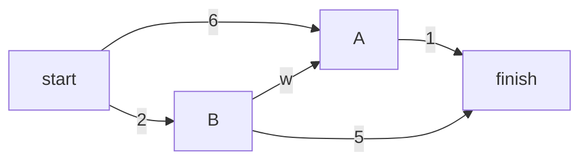
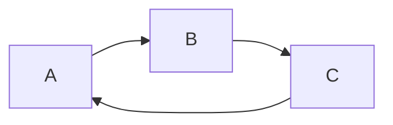
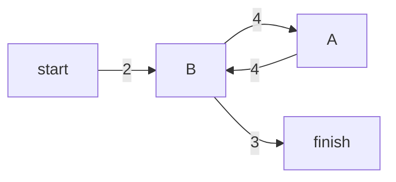
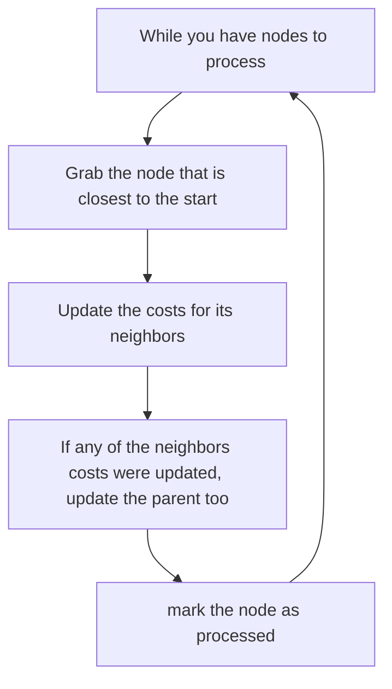

# Dijkstras Algorithm

> If you want to find the fastest path instead of the shortest path (breadth first search) you can use dijkstras algorithm.

## Working with dijkstras algorithm



Each segment has a travel time in minutes. You can use Dijkstra's algorithm to go from Start to Finish in the shortest possible time.

There are four steps to Dijkstra's algorithm:

1. Find the "cheapest" node. This is the node you can get to in the least amount of time.
2. Update the costs of the out-neighbors of this node.
3. Repeat until you've done this for every node in the graph.
4. Calculate the final path.

The difference to breadth-first search is: Breadth-first search would have searched for the fewest number of segments not the shortest amount of time.
This is because you assign a number or weight to each segment. Then Dijkstras Algorithm finds the path with the smallest total weight.

### Terminology

When you work with dijkstras algorithm, each edge in the graph has a number associated with it. These are called weights.
A graph with weights is called a weighted graph, a graph without weights is called an unweighted graph.

To calculate the shortest path in an unweighted graph, use breadth-first search. To calculate the shortest path in a weighted graph, use Dijkstra's algorithm. G.
You need to store the outneighbors and the cost for getting to that neighbor in the graph. To represent those edges you can use another hashtable.

After creating the graph you will need a hash table to store the current costs foreach node. The cost of a node is how long it takes to get to that node from raphs can also have cycles. A cycle looks like this:



It means you can start at a node, travel around, and end up at the same node. Suppose you're trying to find the shortest path in t his graph that has a cycle.



Would it make sense to follow the cycle? You can either use the path that avoids the cylce (total weight 5) or you can follow the cycle (total weight: 13).
You would end up at the target node either way, but the cycle adds more weight. You could theoretically also follow the cycle twice (total weight: 21).

You should also remember the difference between directed and undirected graphs:

- A undirected graph means that both nodes point to each other. That's a cycle
- With an undirected graph, each edge adds another cycle. Dijkstras algorithm only works on graphs with no cycles, where all the edges are nonnegative.

### Implementation

To code the example three hashtables are required.
The costs and parents hash tables will be updated as the algorithm progresses.
To start you need to implement the graph (hashtable).
You need to store the outneighbors and the cost for getting to that neighbor in the graph. To represent those edges you can use another hashtable.

After creating the graph you will need a hash table to store the current costs for each node. The cost of a node is how long it takes to get to that node from Start.
If you don't know the cost to get to a node yet, you can use infinity.

The third hash table you will need is one to represent the parents. Finally you need a set to keep track of the nodes that have already been processed.

The algorithm looks like this:



Implemented this looks like this:

```python
def find_lowest_cost_node(costs):
        lowest_cost = math.inf
        lowest_cost_node = None

        for node in costs:
                cost = costs[node]
                if cost < lowest_cost and node is not in processed:
                        lowest_cost = cost
                        lowest_cost_node = node

        return lowest_cost

node = find_lowest_cost_node(costs)

while node is not None:
        cost = costs[node]
        neighbors = graph[node]

        for n in neighbors.keys():
                new_cost = cost + neighbors[n]
                if costs[n] > new_cost:
                        costs[n] = new_cost
                        parents[n] = node

        processed.add(node)
        node = find_lowest_cost_node(costs)
```

To find the lowest cost node, you loop through all the nodes each time there is a more efficient version of this algorithm.

If you have negative weights you can use the Bellman-Ford algorithm.
