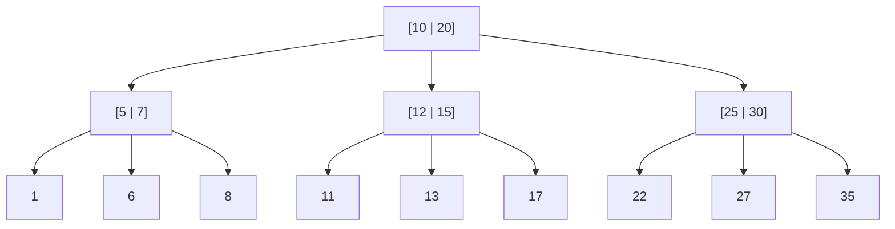

# Balanced Trees

The goal is to have the search speed of a sorted array with a faster insertion speed.
You therefor need some type of datastructure that combines linked lists and sorted array.

This datastructure is a tree! Specifically a balanced binary search tree (BST).
In a binary search tree each node has up to two children: the left and the right child. The special property of BST is that the value of the left child is always smaller than the node, and the value of the right child.
In addition all the numbers in the left subtree are smaller than the node and all the values in the right subtree are bigger than the node.

This property is the reason why searches are really fast in BST.

## Shorter trees are faster

If you have seven nodes, the height of the best case tree is 2, this means you can get to any node from the root node in, at most, two steps.
The height for the worst case tree is 6. This means you can get to any node from the root node in, at most, six steps.
The worst case tree is taller, and it has worse performance. In the worst-case tree, the nodes are all in a line.
This tree has height O(n), so searches will take O(n) time.
The best case tree has the height O(log n), searching this tree will take O(log n) time.
To make a BST shorter you need to balance it.

## AVL Trees

> AVL trees are a type of self-balancing BST. This means AVL-trees will maintain a height of O(log n). Whenever the tree is out of balance - the height not being O(log n) - it will correct itself.

AVL trees use rotation to balance.

### How does AVL know when to rotate

For the tree to know when it will have to balance itself, it needs a few extra informations. Each node stores one of two pieces of information: its height or a balance factor (can be -1, 0, 1).

- `-1` Means the left child is ONE taller
- `0` Means the two childs have the same length
- `1` Means the right child is ONE taller

The balance factor lets the tree now when to rebalance, 0 menas the tree is balanced. -1 or 1 is ok because AVL trees don't have to be perfectly balanced.
If the balance factor drops below -1 or above 1, the tree needs to rebalance.

> Note: AVL trees need at most one rebalancing. AVL trees are a good option if you want balanced BST. AVL tree guarantee O(log n) height.

Insertion follows the same procedure, you would look for the place to insert the node and insert it there, hence insertion also takes O(log n).

## Splay trees

AVL trees are a good basic balanced BST that guarantees O(log n) time for a bunch of operations.
Splay trees are a different take on balanced BSTs.

When you look up a node in a splay tree, it will take that node the new root, so if you look it up again the lookup will be instant. In general, the nodes you have looked up recently get clustered to the top and become faster too look up.

The tradeoff is the tree is not guaranteed to be balanced. So some searches may take longer than O(log n). Some searches may take as long as linear time.
Also, while performing the search, you may have to rotate the node up to the root if it is not already the root, which will take time.

The interesting thing is that if you do n searches, the total time is O(n log n) guaranteed - that is O(log n) per search. So eventough a search may take longer than O(log n) time, overall, they will avarage out to O(log n) time.

## B-trees

B-trees are a generalized form of binary tree. They are often used for building databases.

Unlike binary trees, B-trees can have many more children. Also unlike the previous trees, most nodes, have two keys.
So not only can nodes in B-trees have more than two children, they can have more than one key!

### Advantages of B-trees

B-trees have a very interesting optimization because it's a physical optimization. Computers are physical objects, so when looking things up in a tree, a physical object has to move to retrieve that data.
This is called seek time. Seek time can be a big factor in how fast or slow an algorithm is.

The fundamental idea of B-trees is that once you've done that seek, you might as well read a bunch of stuff into memory.
B-trees have bigger nodes: each node can have many more keys and children than a binary tree. So you spend more time reading each node. But you seek less because you read more data in one go. This is what makes B-trees faster.

The B-tree is also sorted, each key to the left are smaller and the keys to the right are bigger.

