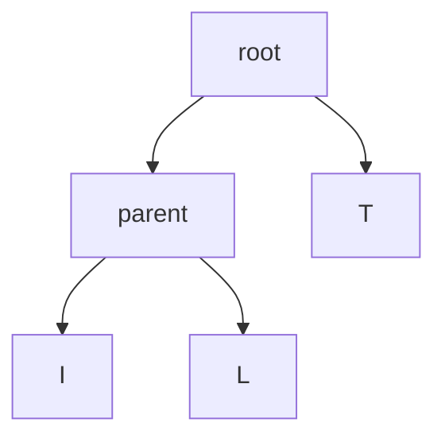

# Trees

> Trees are subset of graphs. They are worth covering separately as there are many specialized types of trees. For example binary trees.
> Most databases use a balanced tree like a B-tree
> A better definition is: A tree is a connected, acyclic graph.

Just like graphs trees are made up of nodes and edges. Rooted trees have one node that leads to all the other nodes.
Nodes can have children and Child-Nodes can have a parent. In a tree, nodes have at most one parent, the only node with no parents is the root. Nodes with no children are called leaf nodes.

## File directories

Since a tree is a type of a graph, you can run a graph algorithm on it, you could for example use breadth-first search.
You can represent a file directory as a tree.
Assume you have the following directory:
```bash
pics
  |_ 2001
  |  |_ a.png
  |  |_ space.png
  |_ test.png 
```

You could represent this as a tree where pics is the root, test.png is a leaf node and 2001 is a child node that has two leaf nodes.
Since the file directory is a tree (graph) you can run a graph algorithm on it.
If you wanted to print all the files in the directory you could apply breadth-first search:
```python
from os import listdir
from os.path iport isfile, join
from collections import deque

def printnames(start_dir):
  search_queue = deque()
  search_queue.append(start_dir)

  while search_queue:
    dir = search_queue.popleft()
    for file in sorted(listdir(dir)):
      fullpath = join(dir, file)
      if isfile(fullpath):
        print(file)
      else:
        search_queue.append(fullpath)
```

Since nodes in trees only have one parent, you don't have to keep track of the nodes you already visited so you don't visit them again.

> Note: One important thing about trees is that they don't have cycles.

## Depth First Search

To understand the idea try traversing the file directory again but recursively:
```python
from os import listdir
from os.path import isfile, join

def printnames(dir):
  for file in sorted(listdir(dir)):
    fullpath = join(dir, file)
    if isfile(fullpath):
      print(file)
    else:
      printnames(fullpath)
```

Notice how you don't have to use a queue, instead if you come across a folder, you can immediately look inside for more files and folders.
Now you have two ways of listing the file names. BUT they will print the file names in different order.

The difference between breadth-first search and depth-first search is, that breadth-first search goes level by level through the tree (or graph) while depth first search takes one branch and follows it to the end before doing it for the next branch.
They are closely related, but note that depth-first search cannot be used for finding the shortest path.

## Binary Trees

> Binary trees are a very common type of trees.
> It is a special type of tree where nodes can have at most two children (hence the name binary). These are traditionally called left child and right child.
> An ancestry tree is an example for a binary tree since everyone has two biological parents.

One important thing is that you never have more than two children. Sometimes you can refer to the left and right subtree.

### Huffman coding 

Huffman coding is an example of using binary trees. It is also the basis for text compression algorithms.

> Background: To know how compression works, you need to know how much space a text file takes. Suppose you have a text file with just on word: tilt. How much space does that use? To figure that out you can use the `space` command on a Unix based system. (The file takes up 4 bytes, 1 byte per character)
> Assuming ISO-8859-1 each letter takes up exactly 1 byte. For example the letter a is ISO-8859-1 code 97, which you can write in binary as 01100001 (8 bit).
> A Bit is a digit that can be either 0 or 1. And there are eight of them. Eight Bit is equal to one byte.ISO-8859-1 goes from 00000000 (null character) to 11111111 (Latin lowercase letter y with diaresis). There are 256 possible combinations of 0s and 1s so the ISO-8859-1 code allows for 256 possible letters.

Compression now does the following in the word tilt you don't need 256 letters, just three. So instead of 8 bits you only need 2. You could now come up with your own 2 bit code just for these letters.

Huffman coding does exactly that: it looks at the characters being used and tries to use less than 8 bits. That is how it compresses the dat.
Huffman coding generates a tree:


You can use this tree to find the code for each letter. Starting at the root node, find a path down to the letter L. Whenever you choose a left branch, append 0 to your code. When you choose a right branch add a 1.
For the letters T, I and L this code would be: T = 1, L = 01, I = 00

The letter T only has one digit. Unlike ISO-8859-1 in Huffman coding, the codes don't all have to be the same length.
Since there is a possibility for different lengths, you can't decode the text by using chunks, instead you have to go through each digit and follow it down the tree until you are at a leaf node. This leaf node is the encoded letter. The next digit continues at the top of the tree.
This is more work to do, but there is one big benefit: The letters that show up more often have shorter codes.
Also note that with Huffman coding letters only show up at leaf nodes, And there's a unique path from the root to each leaf (letter). It also uses a rooted tree.
